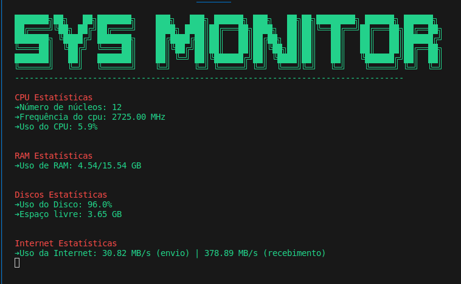

# Sys Monitor

Sys Monitor é um programa simples em Python que monitora o desempenho do sistema exibindo estatísticas detalhadas no terminal. O programa utiliza a biblioteca psutil para obter informações sobre o uso da CPU, RAM, disco e interface de rede.

## Funcionalidades

## Requisitos

    Python 3.x
    Biblioteca psutil (pode ser instalada via pip install psutil)

## Execução

    git clone https://github.com/DiogoThomaz/sys_monitor.git

Execute o programa:

bash

    python sys_monitor.py

## Personalização do Banner

Você pode personalizar o banner do programa alterando o conteúdo do arquivo banner.txt.
Observações

    O programa utiliza cores ANSI para destacar diferentes partes das estatísticas no terminal.

    Os dados são atualizados a cada 2 segundos, proporcionando uma visão em tempo real do desempenho do sistema.

    Em caso de erro ao obter dados do sistema, uma mensagem de erro será exibida no terminal.